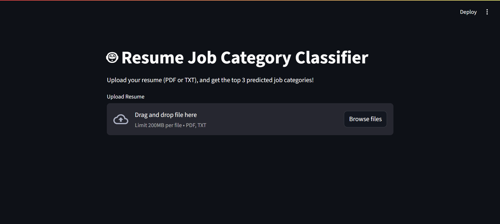
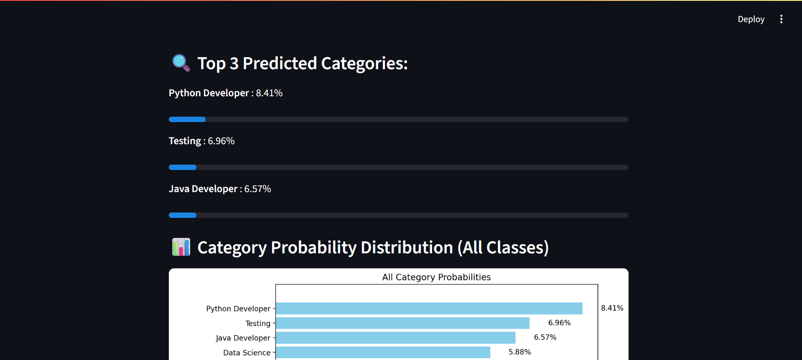
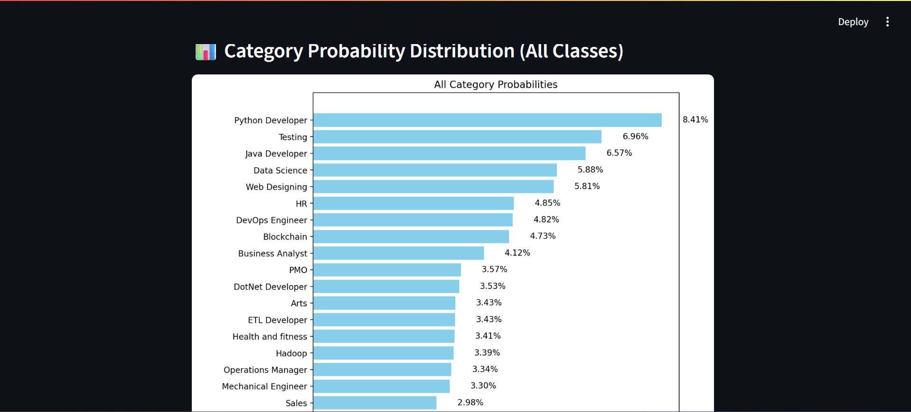

# 🤖 AI Resume Classifier

This project is an **AI-powered Resume Classifier Web App** that predicts the top 3 job roles from uploaded resumes (PDF or TXT) using NLP and Machine Learning.

---

## 📝 **About the Project**

This web app:
- Extracts text from resumes
- Cleans and vectorizes the content
- Predicts top job categories using a pre-trained classification model
- Displays probabilities in an intuitive horizontal bar chart

---

## ⚡ **Live Demo**

👉 **Try it here:** [AI Resume Classifier](https://ai-resume-classifier-05wr.onrender.com)

*(Note: Free Render tier may take ~50s to wake up)*

---

## 👥 **Collaborators**

- **Darshan C M**
  - [GitHub](https://github.com/DRAX355)
  - [LinkedIn](https://www.linkedin.com/in/darshan-cm)

- **Suveer S R**
  - [GitHub](https://github.com/srsuveer1807)
  - [LinkedIn](https://www.linkedin.com/in/suveersr18/)

---

## 💻 **Tech Stack**

- **Python 3.11**
- **Streamlit**
- **Scikit-Learn**
- **PyMuPDF (fitz)**
- **Render (Deployment)**
- **Docker (Containerization)**

---

## 🚀 **Run Locally**

Clone the repo:

```bash
git clone https://github.com/DRAX355/AI-RESUME-CLASSIFIER.git
cd AI-RESUME-CLASSIFIER
```
## Install dependencies:
```bash
pip install -r requirements.txt
```
Run the Streamlit app:
```bash
streamlit run app.py
```
Then open http://localhost:8501 in your browser.

🐳 Run with Docker
Build the image:
```bash
docker build -t resume-classifier .
```
Run the container:
```bash

docker run -p 8501:8501 resume-classifier
```
Then open http://localhost:8501.

## 📁 Project Structure
-app.py – Streamlit frontend and ML integration

-resume_classifier_model.pkl – Trained classification model

-tfidf_vectorizer.pkl – Vectorizer used during training

-Dockerfile – For containerized deployment

-requirements.txt – Python dependencies

## 💡 Features
-Upload resumes in PDF or TXT format

-Clean text and remove noise efficiently

-Predict top 3 job categories with probability scores

-Visualize predictions using horizontal bar charts

## 🖼️ Screenshots

### 🔹 Home Page


### 🔹 Top 3 Predictions


### 🔹 Bar Chart



## 📌 Future Enhancements
-Resume ranking based on JD matching

-Integration with applicant tracking systems

-Support for DOCX resumes

-Model fine-tuning on larger diverse datasets


## ⭐ Give this repo a star if you find it useful!
